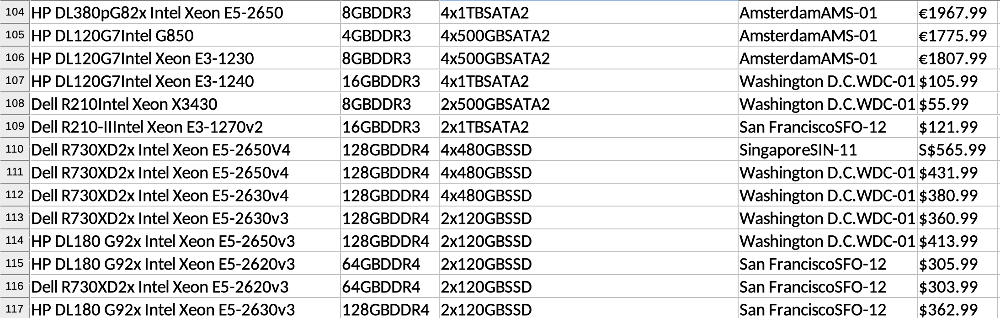
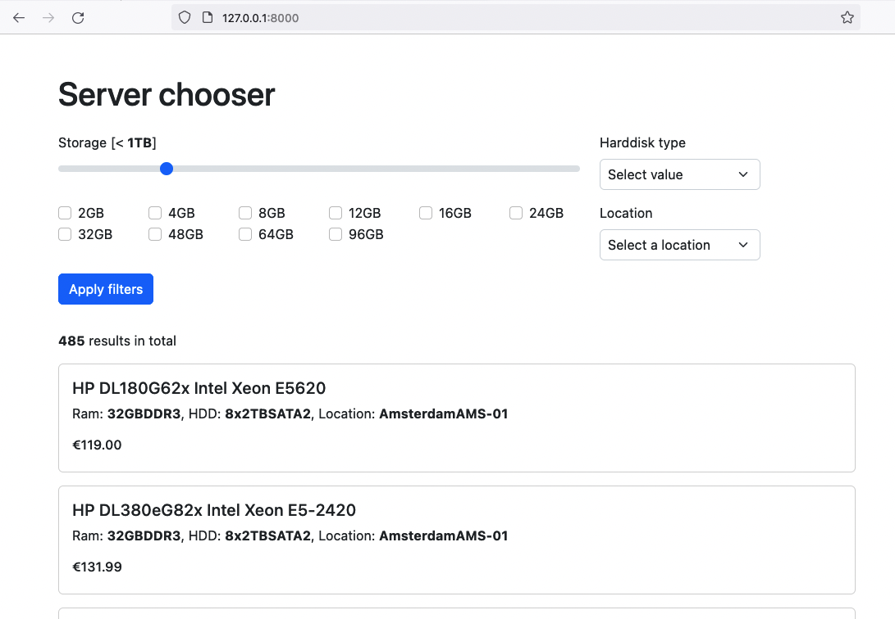

## Server chooser

**Server chooser** is a web application that you can use to search servers for stored 
data.

[Architectural doc](docs/architecture.md) contains details about system design.

### Installation

To install the software the pre-requisites are 
- [PHP 8.1](https://www.php.net/downloads.php)
- [Composer](https://getcomposer.org/download/)
- [Symfony cli](https://symfony.com/download#step-1-install-symfony-cli)

Steps to install:

- Open terminal
- Clone repository
    ```bash
    $ git clone https://github.com/0hsn/server-chooser.git
    ```

- Change to directory
    ```bash
    $ cd server-chooser
    ```

- <details>
    <summary>Add `.env`</summary>

    Add a .env file with following content in current directory.
  
    ```ini
        APP_ENV=dev
        APP_SECRET=5f6bf8f899b3359da6d9667612ca5ca4
        MESSENGER_TRANSPORT_DSN=doctrine://default?auto_setup=0
        DATABASE_URL="sqlite:///%kernel.project_dir%/var/data.db"
    ```
    </details>
    
- Install packages 
    ```bash
    $ composer install
    ```


- Make sure `/var/uploads` directory is writable

- To insert data prepare an `.xlsx` file in following format

    

    Run the command to covert and store the data in internal datastore. Build internal data store

    ```bash
    $ php bin/console app:load-excel ~/path-to-excel/LeaseWeb_servers_filters_assignment.xlsx
    ```
  
- Start web server
    ```bash
    $ symfony server:start --no-tls
    ```

- Open browser at given URL. Most of the case it's `http://127.0.0.1:8000`

### Usage

**`NB:`** Make sure you have an active internet connection

When browser is pointed to server location (most of the case it's 
`http://127.0.0.1:8000`), it's expected to see following page.

Please add or remove filters, and then press _Apply filter_ to get data. 
You'll see pagination at the bottom of search result, based on result 
stored on internal storage.



### Development

- Fork the repository
- Please do all new change in a new branch
- Follow _**Installation**_ steps for local setup
- Use your preferred IDE / Editor to edit code
- PR the branch against `main` repository

To run tests do following:
- Make sure you have server running
- Run `phpunit`
  ```bash
  $ php bin/phpunit
  ```
