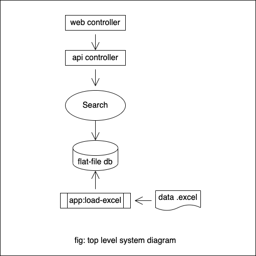
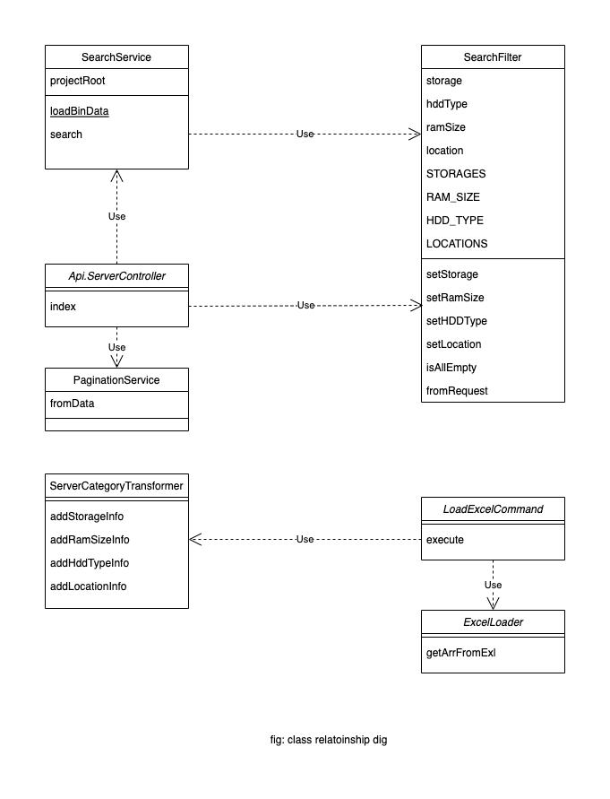

## Architecture

### Overall process

1. System user runs the software
2. System user loads the Excel data and save to a php serialized array of binary file
3. Regular user requests the system, using web front-end
4. Web front-end calls API with request params to load the data
5. API loads the binary file content, un-serialized, and applies filter
6. API data gets send as JSON response

Following technology used at their latest version: 

- [Symfony framework 6.1](https://symfony.com/)
- [Alpine.js 3.10](https://alpinejs.dev/)
- [Bootstrap framework 5.2](https://getbootstrap.com/docs/5.2/getting-started/introduction/)

### Diagrams

Following is the system diagram of the system developed.

---
Following is the class diagram of the system developed.

